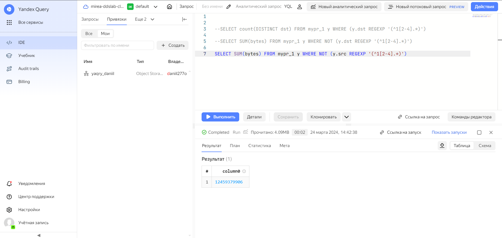

# Лабораторная работа №1
Шевченко Д. Д.

# Цель работы:

### 1) Изучить возможности технологии Yandex Query для анализа структурированных наборов данных

### 2) Получить навыки построения аналитического пайплайна для анализа данных с помощью сервисов Yandex Cloud

### 3) Закрепить практические навыки использования SQL для анализа данных сетевой активности в сегментированной корпоративной сети

# Ход работы:

## Шаг №1: Проверить доступность данных в Yandex Object Storage

## Шаг №2: Подключить бакет как источник данных для Yandex Query

### 1. Создать соединение для бакета в S3 хранилище

### 2. Заполняем поля с учетом допустимых символов, выбираем тип аутентификации – публичный. Вводим имя бакета в соответствующее поле и сохраняем.

### 3. Теперь, после создания соединения, укажем какой объект использовать в качестве источника данных. Для этого нужно сделать привязку данных

### 4. Настройку привязки данных.

## Задание №1

### Известно, что IP адреса внутренней сети начинаются с октетов, принадлежащих интервалу \[12-14\]. Определите количество хостов внутренней сети, представленных в датасете.

## Задание №2

### Определите суммарный объем исходящего трафика

## Задание №3

### Определите суммарный объем входящего трафика

## Вывод

### В данной работе получилось, используя сервис Yandex Query, настроить доступ к данным, хранящимся в сервисе хранения данных Yandex Object Storage. При помощи соответствующих SQL запросов ответить на вопросы.
