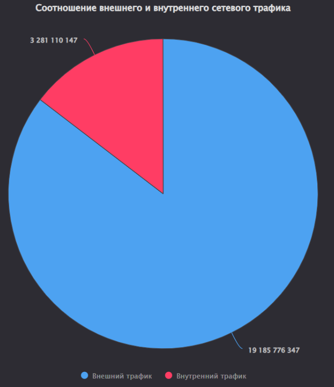
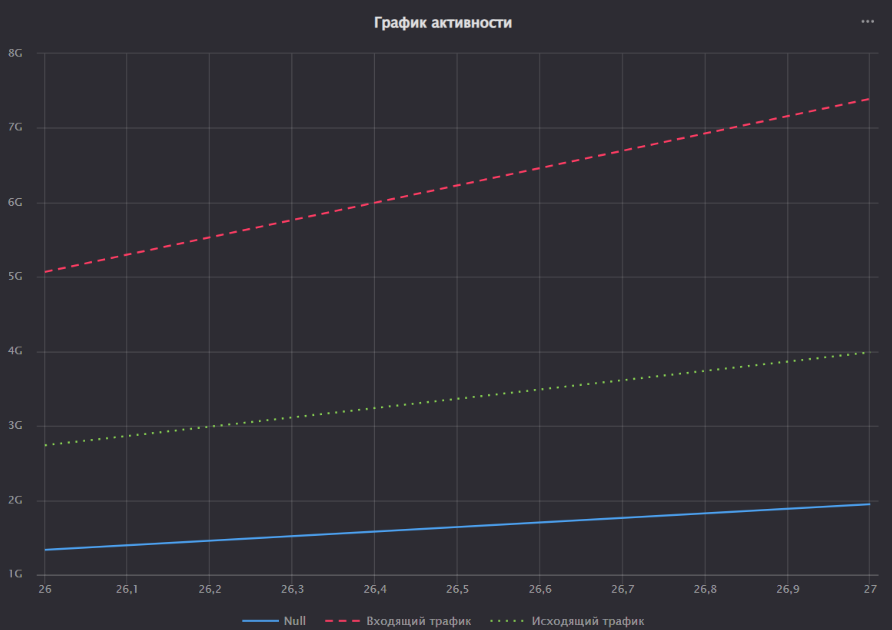
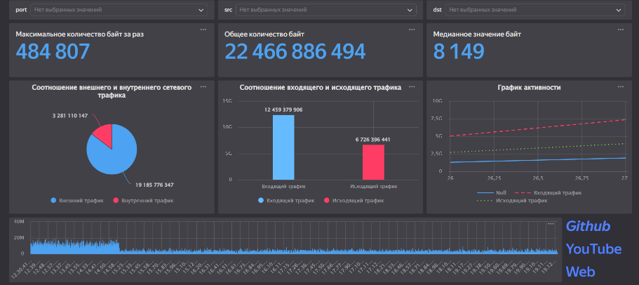
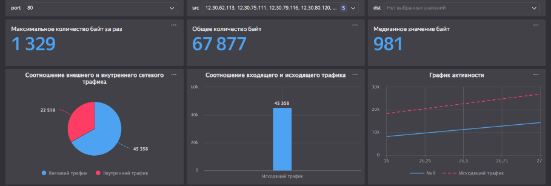

# Лабораторная работа №2
Шевченко Д. Д.

## Цель работы

1.  Изучить возможности технологии Yandex DataLens для визуального
    анализа структурированных наборов данных
2.  Получить навыки визуализации данных для последующего анализа с
    помощью сервисов Yandex Cloud
3.  Получить навыки создания решений мониторинга/SIEM на базе облачных
    продуктов и открытых программных решений
4.  Закрепить практические навыки использования SQL для анализа данных
    сетевой активности в сегментированной корпоративной сети

## Исходные данные

1.  ОС Windows
2.  Технология Yandex DataLens
3.  Сервис Yandex Cloud
4.  RStudio

## Описание шагов:

1.  *Используя сервис Yandex DataLens настроить доступ к результатам
    Yandex Query*

-   Перейдём по ссылке https://datalens.yandex.ru/

-   Создадим новое подключение

-   Настроить и проверить подключение

    

1.  Представить в виде круговой диаграммы соотношение внешнего и
    внутреннего сетевого трафика

    

2.  Представить в виде столбчатой диаграммы соотношение входящего и
    исходящего трафика из внутреннего сетевого сегмента.

    

3.  Построить график активности (линейная диаграмма) объема трафика во
    времени.

    

4.  Все построенные графики вывести в виде единого дашборда в Yandex
    DataLens

    

    

    

## Оценка результатов

``` r
x <- 5
x
```

    [1] 5

## Вывод

Удалось изучить возможности технологии Yandex DataLens для визуального
анализа структурированных наборов данных, получить навыки визуализации
данных для последующего анализа с помощью сервисов Yandex Cloud,
получить навыки создания решений мониторинга/SIEM на базе облачных
продуктов и открытых программных решений и закрепить практические навыки
использования SQL для анализа данных сетевой активности в
сегментированной корпоративной сети
